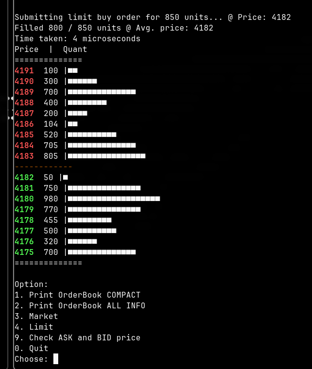
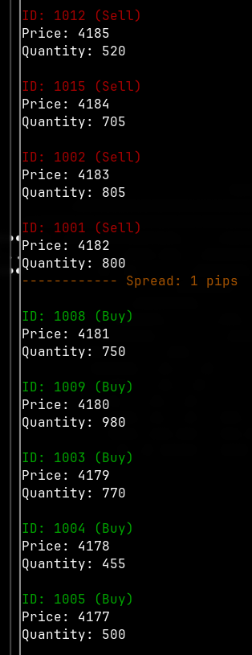
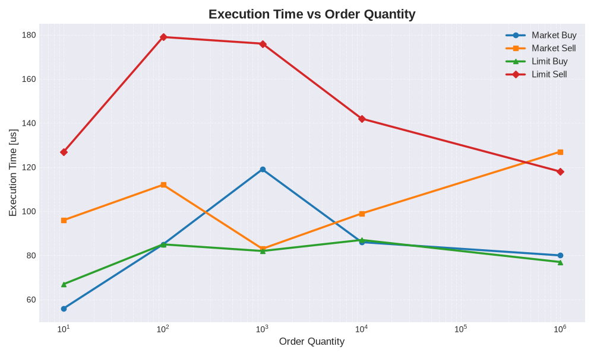

<p align="center">
  OrderBook Matching Engine written in C++17.
</p>

---

## Design Choices and Goals

Created engine is not indended to compete with the most efficient ones. This is an educational project created for inclusion in my CV.

---

## Showcase

<p align="left">
  
  
</p>

---

## Requirements

- **OS:** Linux  
  Developed and tested on Arch Linux

- **Compiler:** GCC with C++17 support

- **Build system:** Make

---

## Clone and Build

```bash
git clone https://github.com/Majkii2006/OBEngine.git
```

Then configure and build the project:

```bash
make build
```
Then run executable or do it by:
```bash
make run
```
---

### Execution order test plot:




---
  
## License

Licensed under the Apache License, Version 2.0.  
See the [LICENSE](LICENSE) and [NOTICE](NOTICE) files for details.
